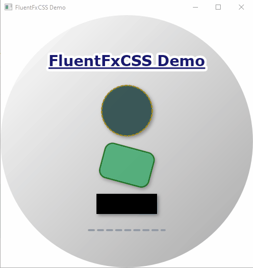

# FluentFxCSS

[](https://opensource.org/licenses/MIT)
<!-- Optional: Add build status badge -->

FluentFxCSS provides a fluent, type-safe builder API to programmatically construct CSS styles for JavaFX `Node`, `Region`, `Shape`, and `Text` elements. Simplify your JavaFX styling with readable and maintainable code.



## Key Features

*   **Fluent & Type-Safe:** Intuitive chained methods with compile-time safety.
*   **Reusable Styles:** Build `StyleDefinition` objects to apply or merge styles.
*   **CSS Generation:** Apply styles inline or generate CSS class/pseudo-class strings.
*   **Unit Support:** Specify units (PX, EM, PT, CM, etc.) for many length properties.

## Installation

:warning: Requires JDK 11, or above.

Example for Maven and Gradle, where `x.y.z` is the library version, e.g., `1.0.0`:

**Maven Example:**

```xml
<dependency>
    <groupId>com.brunomnsilva</groupId>
    <artifactId>fluentfxcss</artifactId>
    <version>x.y.z</version>
</dependency>
```

**Gradle Example:**

```gradle
implementation 'com.brunomnsilva:fluentfxcss:x.y.z'
```

## Quick Start

```java
import com.example.fluentfxcss.FluentFxCss;
import com.example.fluentfxcss.definition.StyleDefinition;
import javafx.scene.layout.Pane;
import javafx.scene.paint.Color;

Pane myPane = new Pane();

StyleDefinition paneLook = FluentFxCss.paneStyle()
    .padding(10) // Defaults to PX
    .backgroundColor(Color.LIGHTBLUE)
    .build();

paneLook.applyTo(myPane);
```

## Supported CSS Properties (Fluent API)

The following CSS properties have direct fluent methods in their respective stylers. Styler methods are inherited, so `RegionStyler` includes all `NodeStyler` methods, `ShapeStyler` includes `NodeStyler` methods, and `TextStyler` includes `ShapeStyler` (and thus `NodeStyler`) methods. Click on a styler to see its specific additions and inherited properties.

<details>
  <summary><strong>NodeStyler</strong> (Base for all - click to expand)</summary>

Properties common to all JavaFX Nodes. These methods are available on all more specific stylers through inheritance.

🗏 [JavaFX CSS Reference](https://openjfx.io/javadoc/11/javafx.graphics/javafx/scene/doc-files/cssref.html#node)

| CSS Property              | Example Fluent Method(s)                                  |
  |---------------------------|-----------------------------------------------------------|
| `-fx-opacity`             | `.opacity(double value)`                                  |
| `-fx-effect` (DropShadow) | `.dropShadow(BlurType, Color, radius, spread, offX, offY)` |
| `-fx-effect` (InnerShadow)| `.innerShadow(BlurType, Color, radius, choke, offX, offY)`|
| `-fx-cursor`              | `.cursor(Cursor cursor)`                                  |
| `-fx-visible`             | `.visible(boolean value)`                                 |
| `-fx-rotate`              | `.rotate(double degrees)`                                 |
| `-fx-scale-x` / `-fx-scale-y` | `.scaleX(double)`, `.scaleY(double)`, `.scale(double factorXY)` |
| `-fx-translate-x` / `-fx-translate-y` | `.translateX(double)`, `.translateY(double)`, `.translate(double dXY)` |
| `-fx-blend-mode`          | `.blendMode(BlendMode mode)`                              |
| `-fx-node-orientation`    | `.nodeOrientation(NodeOrientation orientation)`           |
  <!-- Add other NodeStyler properties here if you add them, e.g., ColorAdjust, GaussianBlur -->

</details>

<details>
  <summary><strong>RegionStyler</strong> (Extends NodeStyler - click to expand)</summary>

Adds properties specific to `javafx.scene.layout.Region` nodes. Includes all `NodeStyler` properties.

🗏 [JavaFX CSS Reference](https://openjfx.io/javadoc/11/javafx.graphics/javafx/scene/doc-files/cssref.html#region)

| CSS Property              | Example Fluent Method(s)                                  |
  |---------------------------|-----------------------------------------------------------|
| `-fx-background-color`    | `.backgroundColor(Paint paint)`                           |
| `-fx-background-radius`   | `.backgroundRadius(double radius)` / `..(UnitValue, ...)` |
| `-fx-padding`             | `.padding(double allSides)` / `..(UnitValue, ...)`        |
| `-fx-border-color`        | `.borderColor(Color color)` / `..(colors...)`             |
| `-fx-border-style`        | `.borderStyle(BorderStyleValue style)` / `..(styles...)`   |
| `-fx-border-width`        | `.borderWidth(double width)` / `..(UnitValue, ...)`       |
| `-fx-border-radius`       | `.borderRadius(double radius)` / `..(UnitValue, ...)`     |
| `-fx-shape`               | `.shape(String svgPath)`                                  |
| `-fx-pref-width`          | `.prefWidth(double value)` / `..(UnitValue, ...)`         |
| `-fx-pref-height`         | `.prefHeight(double value)` / `..(UnitValue, ...)`        |
| `-fx-min-width` / `-fx-max-width` | `.minWidth(...)`, `.maxWidth(...)`                   |
| `-fx-min-height` / `-fx-max-height` | `.minHeight(...)`, `.maxHeight(...)`                 |
| `-fx-background-image`    | `.backgroundImage(String url)`                            |
| `-fx-background-repeat`   | `.backgroundRepeat(BackgroundRepeat x, BackgroundRepeat y)`|
| `-fx-background-position` | `.backgroundPosition(...)` (simplified or string)         |
| `-fx-background-size`     | `.backgroundSize(BackgroundSize size)` / `..(String)`     |
| `-fx-background-insets`   | `.backgroundInsets(Insets insets)` / `..(values)`         |

</details>

<details>
  <summary><strong>ShapeStyler</strong> (Extends NodeStyler - click to expand)</summary>

Adds properties specific to `javafx.scene.shape.Shape` nodes. Includes all `NodeStyler` properties.

🗏 [JavaFX CSS Reference](https://openjfx.io/javadoc/11/javafx.graphics/javafx/scene/doc-files/cssref.html#shape)

| CSS Property              | Example Fluent Method(s)                                  |
  |---------------------------|-----------------------------------------------------------|
| `-fx-fill`                | `.fill(Paint paint)`                                      |
| `-fx-stroke`              | `.stroke(Paint paint)`                                    |
| `-fx-stroke-width`        | `.strokeWidth(double value)` / `..(UnitValue, ...)`       |
| `-fx-stroke-type`         | `.strokeType(StrokeType type)`                            |
| `-fx-stroke-dash-array`   | `.strokeDashArray(Integer... size)`                       |
| `-fx-stroke-dash-offset`  | `.strokeDashOffset(double value)`                         |
| `-fx-stroke-line-cap`     | `.strokeLineCap(StrokeLineCap cap)`                       |
| `-fx-stroke-line-join`    | `.strokeLineJoin(StrokeLineJoin join)`                    |
| `-fx-stroke-miter-limit`  | `.strokeMiterLimit(double value)`                         |
| `-fx-smooth`              | `.smooth(boolean value)`                                  |

</details>

<details>
  <summary><strong>TextStyler</strong> (Extends ShapeStyler - click to expand)</summary>

Adds properties specific to `javafx.scene.text.Text` nodes. Includes all `ShapeStyler` (and thus `NodeStyler`) properties.

🗏 [JavaFX CSS Reference](https://openjfx.io/javadoc/11/javafx.graphics/javafx/scene/doc-files/cssref.html#text)

| CSS Property              | Example Fluent Method(s)                                  |
  |---------------------------|-----------------------------------------------------------|
| `-fx-font-family`         | `.fontFamily(String family)`                              |
| `-fx-font-size`           | `.fontSize(double size)` (defaults to PT)                 |
| `-fx-font-weight`         | `.fontWeight(FontWeight weight)`                          |
| `-fx-font-style`          | `.fontStyle(FontPosture posture)`                         |
| `-fx-font` (shorthand)    | `.font(Font font)`                                        |
| `-fx-fill` (via Shape)    | `.fill(Paint paint)` or `.textFill(Paint paint)` (alias)  |
| `-fx-font-smoothing-type` | `.smoothing(FontSmoothingType type)`                      |
| `-fx-underline`           | `.underline(boolean value)`                               |
| `-fx-strikethrough`       | `.strikethrough(boolean value)`                           |
| `-fx-text-alignment`      | `.alignment(TextAlignment alignment)`                     |
| `-fx-line-spacing`        | `.lineSpacing(double spacing)`                            |

</details>

**Note 1:** Many methods have overloads for different numbers of arguments (e.g., padding, border radius/width) and for specifying units with `UnitValue`.

**Note 2:** `Paint` values include `Color`, `LinearGradient` and `RadialGradient` instances (which are converted to valid CSS syntax).

:bulb: For any other CSS properties not listed above, or for more complex values, you can use the fallback method available on all stylers:
```java
myStyler.customProperty("-fx-your-css-property", "your-css-value");
```

## Further Information

For more detailed API documentation, advanced usage examples, and information on building and using `StyleDefinition` objects (including CSS class generation and merging), please refer to the [Project Wiki](https://github.com/brunomnsilva/FluentFxCSS/wiki).

You cal also refer to the `FluentFxCssDemo` application code.

## Contributing

Contributions are welcome! 

## License

This project is licensed under the MIT License - see the [LICENSE.md](LICENSE.md) file for details.

